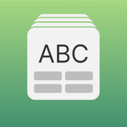

# Flashspeak

Приложение iOS для изучения иностранных слов по наборам карточек.

## Содержание
- [Обзор](#обзор)
    - [Возможности](#возможности)
       - [Выбор языка изучения](#выбор-языка)
       - [Списки слов](#списки-слов)
       - [Создание и редактирование списка слов](#создание-и-редактирование-списка-слов)
       - [Просмотр карточек](#просмотр-карточек)
       - [Редактирование карточки](#редактирование-карточки)
       - [Изучение](#изучение)
       - [Просмотр результатов изучения](#просмотр-результатов-изучения)
       - [Темы приложения](#темы-приложения)
    - [Реализация](#реализация)
       - [API](#api)
            - [Перевод](#перевод)
            - [Изображения](#изображения)
       - [Архитектура](#архитектура)
       - [Паттерны](#паттерны)
       - [Библиотеки](#библиотеки)
       - [Хранение данных](#хранение-данных)
       - [Требования](#требования)
- [Как запустить](#как-запустить)
- [Зачем](#зачем)
- [To Do](#to-do)
- [Команда проекта](#команда-проекта)

## Обзор

### Возможности
Пользователь, [выбрав язык изучения](#выбор-языка), может легко [создать свой список слов](#создание-и-редактирование-списка-слов). Слова можно добавить через вставку или вводя по отдельности. Приложение [сформирует перевод](#перевод) и [найдет подходящие изображения](#изображения) для каждого слова. Пользователь [на главноем экране](#списки-слов) увидит новый список. По нажатию на него, можно [просмотреть получившиеся карточки](#просмотр-карточек), а если перевод и подобранное изображение не подойдут то [можно загрузить свое изображение или изменить перевод слова](#редактирование-карточки). [Изучение можно проходить по различным сценариям](#изучение). Карточку для изучения можно сделать из частей: исходное слово, перевод и изображение. Отвечать на предложенную карточку можно через тестирование или набирая ответ на клавиатуре. Для понимания звучания, есть кнопка произнести слово вслух. Результаты прохождения каждого изучения списка сохранаются и [формируются в статистику](#просмотр-результатов-изучения), так же пользователю будут показаны ошибки для работы над ошибками. Приложение поддерживает [темную и светлую тему](#темы-приложения) отображения.

#### Выбор языка
При первом открытии приложения, пользователь видит экран приветсвия. Приложение просит выбрать родной язык и изучаемый. По кнопке "Начать" сценарий первого старта заканчивается и открывается основной [экран со списками слов](#списки-слов).

https://github.com/DenDmitriev/flashspeak/assets/65191747/ab9d18eb-f2cb-4591-8fd7-e1ce9f1735e7

#### Списки слов
Это главный экран, который пользователь будет видеть при последующих запусках приложения. По началу экран пустой. Чтоб показать пользователю что делать дальше, показывается стрелочка, которая указывает на кнопку создания списка "+". После создания списка, пользователь может его увидеть на главном экране. При длительном нажатии на ячейку списка или по кнопке в верхнем правом углу, открывается меню для управления списком слов. Если пользователь решит изучать другой язык, то он может сменить его по кнопке с изображением флага в верхнем правом углу экрана.

#### Создание и редактирование списка слов
Экран ListMaker...
[DenDmitriev](https://github.com/DenDmitriev)
[OksanaKam](https://github.com/OksanaKam)

#### Просмотр карточек
Экран позволяет просматривать слова, добавленные в карточки вместе с картинками, дает возможность удалять слова, редактировать список и редактировать изображения. [Анастасия](https://github.com/losikova)

#### Редактирование карточки
Экран Card...

#### Изучение
Экран Learn...

#### Просмотр результатов изучения
Экран Result...

#### Темы приложения
- Светлая
- Темная

## Реализация

### API
[Heoh888](https://github.com/Heoh888)
APIs...
#### Перевод

#### Изображения

### Архитектура
 - ModelViewPresenter

### Паттерны
 - Delegate
 - Strategy
 - Caretaker
 - Singleton
 - Coordinator
 - Router
 - Builder

### Библиотеки
- UIKit
- CoreData
- Combine
- AVFoundation 

### Хранение данных
[Анастасия](https://github.com/losikova)
- CoreData

- UserDefaults
- Config.xcconfig

### Требования
- iOS 16.0+
- Xcode 14.3

## Как запустить
- Настройте Config.xcconfig...

## Зачем
Проект создан в рамках курса "Командная разработка на Swift" в школе [GeekBrains](https://gb.ru).

## To Do
- [ ] Добавить трансфер списка слов на другой язык
- [ ] Сделать экран настроек приложения
- [ ] Сделать несколько списков слов по умолчанию при первом открытии приложения
- [ ] Добавить возможность сменить язык в приложении

## Команда проекта
- [DenDmitriev](https://github.com/DenDmitriev)
- [Анастасия](https://github.com/losikova)
- [OksanaKam](https://github.com/OksanaKam)
- [Heoh888](https://github.com/Heoh888)
